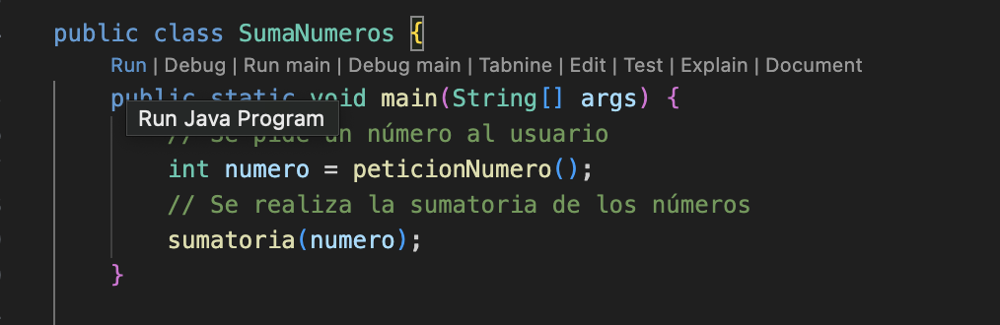

Este proyecto esta realizado con Java

En este proyecto se realizaron ejercicios relacionados con ciclos for y while, condicionales if y usos de switch.
El proyecto consta con las siguientes carpetas:
/Condicionales
    Esta carpeta contiene archivos de tipo de número y cálculo de año bisiesto.
/Switch
    En esta carpeta se encuentran archivos de muetra de día de la semana y un menú de acciones
/While
    Esta carpeta contiene un archivo de suma según números ingresados y recuento de acciones
/For
    En esta carpeta se encuentra un archivo de muestra de números naturales y suma de números anteriores al número ingresado

Para poder probar estos proyectos es necesario contar con la siguiente extención:
Extension Pack for Java 

Que cuenta con todas las herramientas necesarias para poder probar los ejercicios realizados en este proyecto.

Para poder ejecutar los archivos, deben seleccionar la opción "run" que se encuentran en los métodos main de cada archivo.
